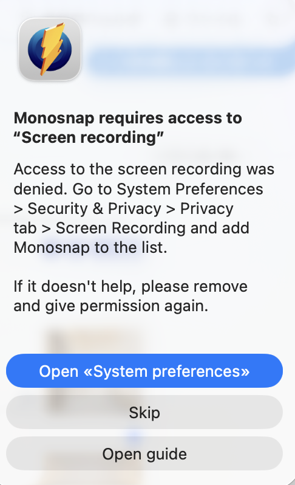

macOSでMonosnapが突然起動しなくなったり、画面収録の許可を与えているのに拒否されるときは **TCC（Transparency, Consent, and Control）データベースが壊れている** 可能性が高いです。アプリを消して再インストールするだけでは直らないので、以下の「完全リセット」手順を順番に実行してください。

## 症状

何度起動しても画面週力を許可してくれポップアップが出る。。


## 結論（原因）

- macOS側の「画面収録（ScreenCapture）」権限が壊れている  
- Monosnapを入れ直してもTCCの権限DBが更新されていない  
- 設定UI上はONでも、内部のDBが壊れている状態だとアプリが拒否され続ける

## ✅ 解決手順（確実版）

### ① Monosnapを完全終了

```bash
killall Monosnap
```

バックグラウンド常駐を含めて強制終了します。

### ② 画面収録の権限を一度外す

`システム設定 > プライバシーとセキュリティ > 画面収録` で Monosnap のチェックを外します。ここではまだ起動できません。

### ③ 権限キャッシュ（TCC）をリセット【重要】

```bash
tccutil reset ScreenCapture
```

パスワードを求められたら入力し、エラーが出なければ成功です。これでmacOSが抱えていた壊れた許可情報が削除されます。

### ④ Macを再起動（必須）

ここは絶対に飛ばさないでください。再起動せずにMonosnapを起動すると、古いキャッシュが復活してやり直しになる確率が高いです。

### ⑤ Monosnapを起動し、許可を“新規登録”

1. Finderの「アプリケーション」からMonosnapを起動  
2. 警告ダイアログが出たら「Open System Preferences」を押す  
3. `画面収録 > Monosnap` のチェックを付け直す  
4. 「再起動が必要」と言われたらMonosnapのみ再起動

### ⑥ それでもダメな場合（最終手段）

Monosnap.app自体を物理的に削除して再登録します。

```bash
sudo rm -rf /Applications/Monosnap.app
```

公式DMGから入れ直し、手順⑤をもう一度実施してください。

## 🔍 なぜこれで直るのか

- macOSの設定UIと実際の許可DB（TCC）は別物  
- UI上はONでもDBが壊れているとアプリは拒否される  
- `tccutil reset ScreenCapture` が壊れたレコードを消す唯一の正攻法

